# UTS_PemrogramanMobile1

  

## PROFIL

| Variable           | Isi                           |
| ------------------ | ----------------------------- |
| **Nama**           | Ahmad Ridho Septian           |
| **NIM**            | 312310447                     |
| **Kelas**          | TI.23.A.5                     |
| **Mata Kuliah**    | Pemrograman Mobile 1          |
| **Dosen Pengampu** | Donny Maulana S.kom., M.M.S.I |

# Selamat datang di project Aplikasi **PrintEase**!

PrintEase adalah aplikasi yang dirancang untuk mempermudah proses pemesanan layanan print seperti percetakan atau usaha print tugas di kampus. Aplikasi ini memungkinkan pengguna untuk membuat dan mengelola pesanan print dengan cara yang sederhana dan efisien. Pengguna dapat memilih jenis layanan print yang diinginkan, mengunggah file, menghitung harga, serta melakukan pembayaran secara langsung melalui aplikasi.

### Tujuan Aplikasi ini dibuat :

1. Memudahkan Proses Pemesanan
   Memberikan kemudahan bagi pelanggan dalam melakukan pemesanan cetak dokumen, tugas, dan kebutuhan lainnya secara online, tanpa harus datang langsung ke tempat print.

2. Pengelolaan Pesanan yang Efisien
   Membantu pengelola dalam mengelola dan memantau setiap pesanan yang masuk melalui dashboard, sehingga proses cetak dapat diatur dengan lebih rapi dan efektif.

3. Menghemat Waktu Pelanggan
   Mengurangi waktu tunggu bagi pelanggan dengan memberikan estimasi waktu penyelesaian dan notifikasi status pesanan. Pelanggan bisa langsung mengambil hasil cetak saat sudah siap.

4. Meningkatkan Kepuasan Pelanggan
   Memberikan pengalaman yang nyaman dan transparan bagi pelanggan, seperti informasi harga, jumlah halaman, dan status pesanan. Hal ini dapat meningkatkan kepuasan dan loyalitas pelanggan.

5. Mendukung Penggunaan Digital
   Mendorong transformasi digital dengan menghadirkan platform pemesanan cetak berbasis aplikasi yang mudah digunakan oleh mahasiswa dan masyarakat umum.

## StoryBoard

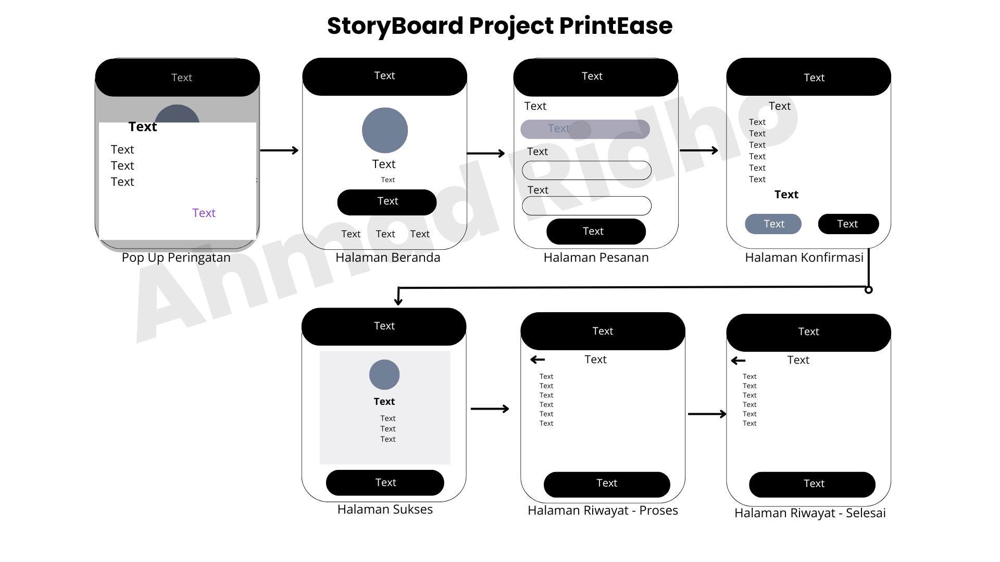

## MockUp

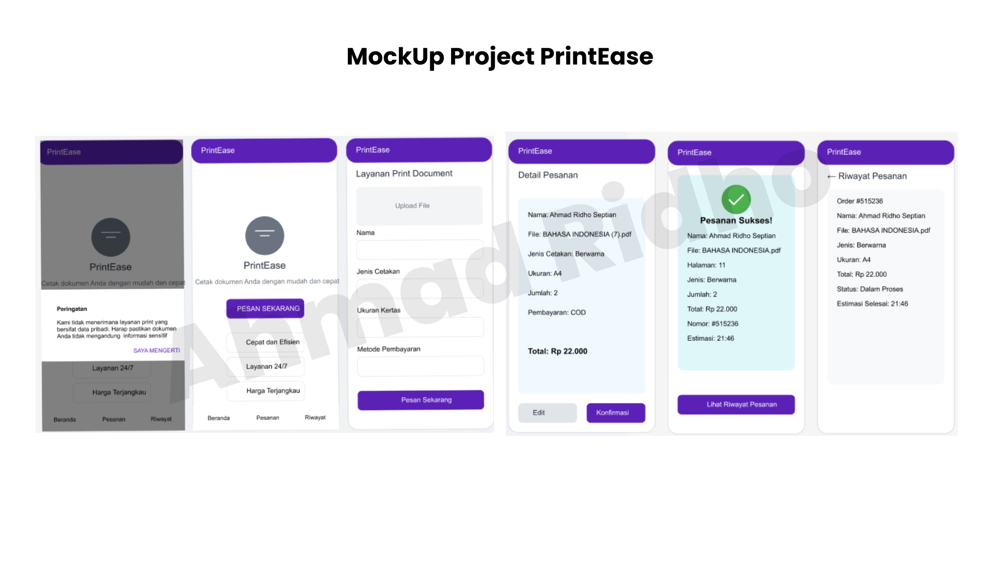

## UI UX

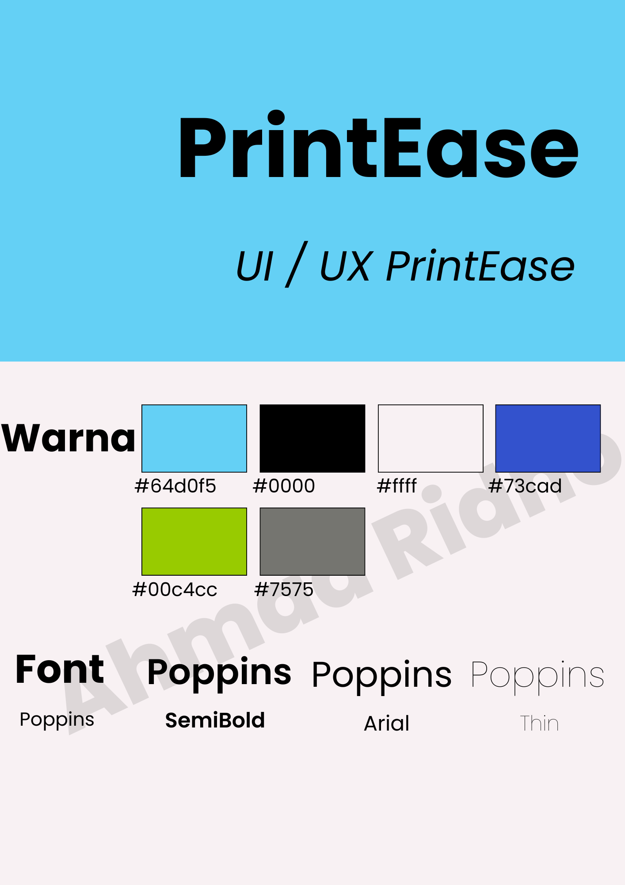

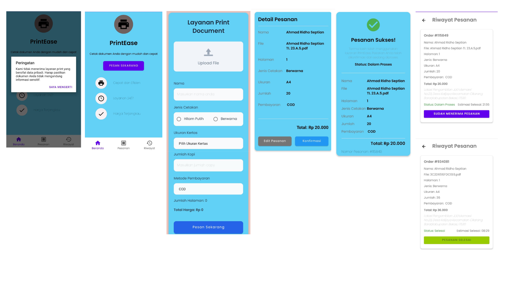

## Status Proyek: **Phase 1**

## Fitur Utama :

### 1. Beranda

   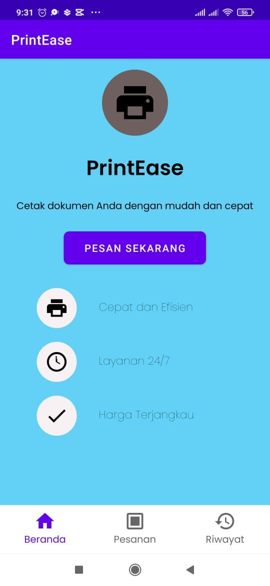

Fitur ini menjadi halaman awal yang dilihat oleh pengguna saat membuka aplikasi. Di sini, pengguna dapat menemukan informasi umum tentang layanan yang ditawarkan, seperti deskripsi layanan. Tujuan dari fitur ini adalah untuk memberikan kesan pertama yang informatif dan menarik, serta mengarahkan pengguna untuk mulai melakukan pemesanan.

- Deskripsi Layanan: Menjelaskan layanan yang diberikan (Cepat & Efisien, Layanan 24/7, Harga Terjangkau).

### 2. Pesanan

   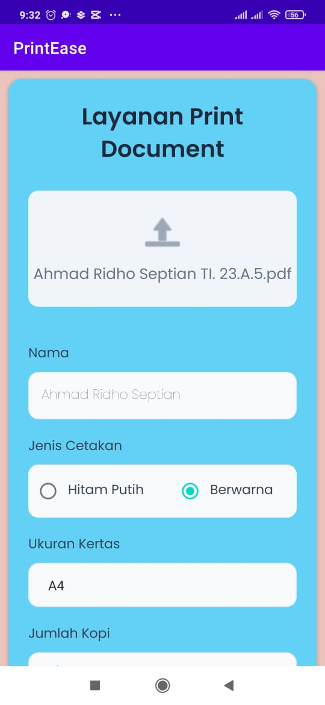

Fitur ini berfungsi sebagai halaman di mana pengguna bisa melakukan pemesanan baru. Pengguna dapat mengunggah file dokumen yang ingin dicetak, memilih jumlah halaman, ukuran kertas, tipe cetak (berwarna/hitam putih), dan opsi lainnya. Fitur ini dirancang untuk memudahkan proses pemesanan cetak secara mandiri oleh pelanggan.

- Unggah File: Memungkinkan pengguna mengunggah dokumen dalam format pdf yang akan dicetak.
- Pengaturan Cetak: Menyediakan opsi seperti ukuran kertas (A4 dan A3), jumlah halaman, jenis cetakan (berwarna atau hitam putih), dan jumlah salinan.
- Estimasi Harga dan Waktu: Menampilkan estimasi biaya cetak dan waktu penyelesaian setelah pengguna mengatur pesanan mereka.
- Opsi Pembayaran: Menyediakan pilihan pembayaran COD.

Setelah pesan sekarang, pengguna masuk ke dalam halaman konfirmasi. pengguna dapat edit pesanan dan dapat juga langsung konfrimasi pesanan.

Dan setelah konfirmasi, berarti pesanan sukses dibuat lalu terdapat nomor ID, Status Pesanan dan detail pesanan.

### 3. Riwayat

   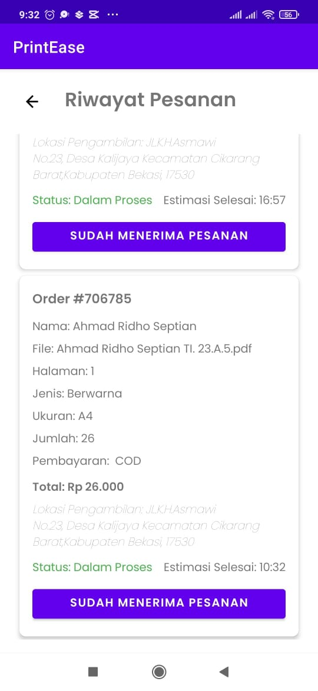

Fitur ini memungkinkan pengguna melihat semua pesanan yang telah mereka lakukan sebelumnya. Pengguna dapat memantau status pesanan, melihat riwayat pemesanan, dan menilai kualitas layanan. Fitur ini berguna bagi pelanggan yang ingin memastikan pesanan mereka sudah siap atau hanya sekedar mengecek detail pesanan yang telah selesai.

- Status Pesanan: Memperlihatkan status terkini dari setiap pesanan (misalnya: Sedang Diproses, Sudah Siap, atau Selesai).
- Detail Pesanan: Menampilkan informasi rinci untuk setiap pesanan, termasuk jumlah halaman, biaya, tanggal pemesanan, lokasi pengambilan dan jam selesai.

---

## Status Proyek: **Phase 2 - Enhancing the Design**

Pada tahap ini, fokus utama kami adalah meningkatkan kualitas desain aplikasi untuk memberikan tampilan yang lebih modern, menarik, dan responsif. Perubahan desain mencakup:

- **Palet Warna**: Menggunakan kombinasi warna yang lebih segar dan harmonis untuk menciptakan kesan profesional dan ramah pengguna.
- **Font & Tipografi**: Menerapkan font yang lebih modern seperti [Poppins](https://fonts.google.com/specimen/Poppins) untuk meningkatkan keterbacaan dan estetika.
- **Antarmuka Pengguna (UI)**: Penyempurnaan tata letak, ukuran tombol, dan elemen visual lainnya untuk pengalaman pengguna yang lebih intuitif.
- **Responsivitas**: Menyesuaikan desain agar optimal pada berbagai ukuran layar.

## Apa yang Baru di Phase 2?

- Palet warna baru yang dirancang untuk menarik perhatian pengguna.
- Tata letak yang lebih bersih dengan jarak antar elemen yang proporsional.
- Peningkatan ikon dan elemen grafis agar lebih modern.
- Perubahan pada halaman konfirmasi dan pembayaran untuk memberikan pengalaman yang lebih lancar.

## Fitur Utama

### 1. Splash Screen

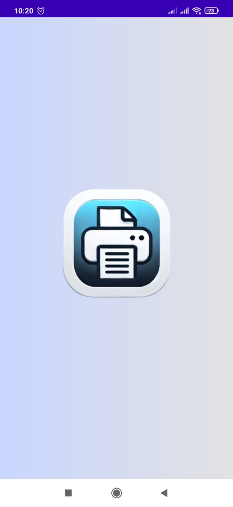

### 2. Beranda

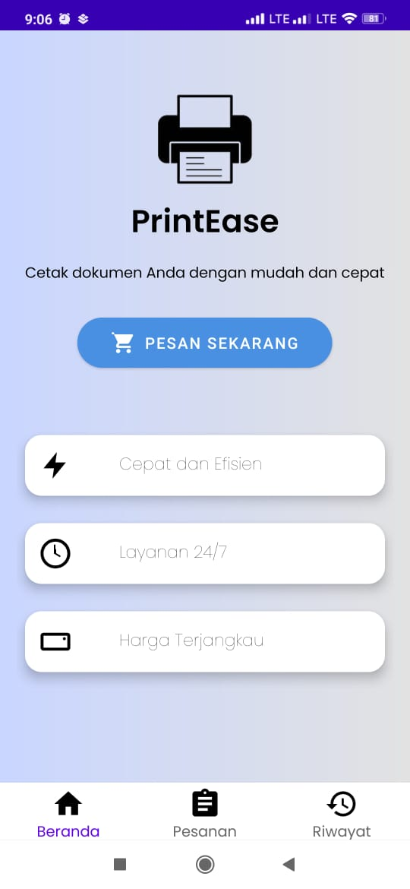

### 3. Pesanan

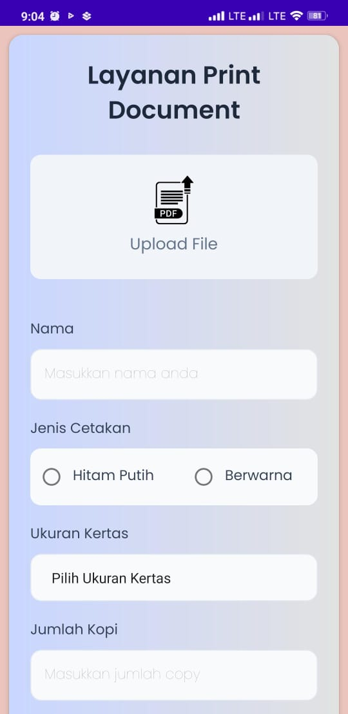

### 4. Edit Pesanan

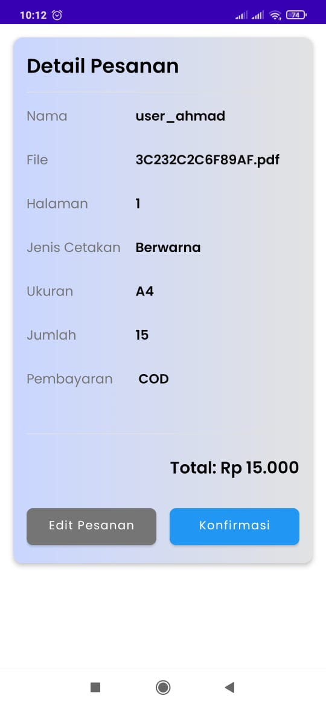

### 5. Pesanan Sukses

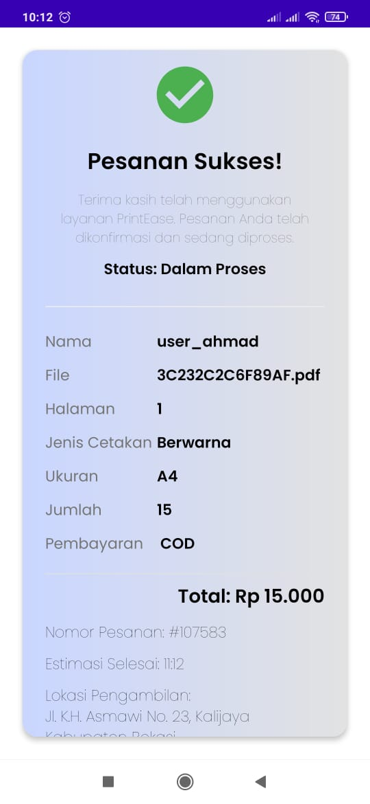

### 6. Riwayat Pesanan

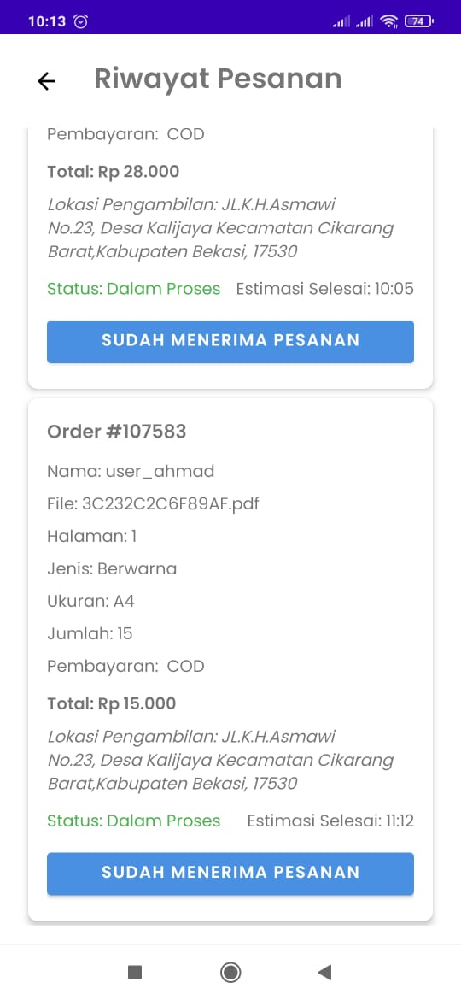

## Cara Menggunakan Aplikasi

1. **Pilih Dokumen:** Upload dokumen yang ingin dicetak.
2. **Sesuaikan Opsi Cetak:** isi Nama,Pilih jumlah halaman, warna, ukuran kertas, dan lainnya.
3. **Lakukan Pembayaran:** Untuk saat ini masih menggunakan pembayaran COD.
4. **Konfirmasi Pesanan:** Dapatkan detail pesanan dan tunggu pesanan Anda selesai.

## Teknologi yang Digunakan

- **Frontend:** Android (Java)
- **Backend:** Firebase Firestore
- **Desain:** Material Design, Poppins Font

---
